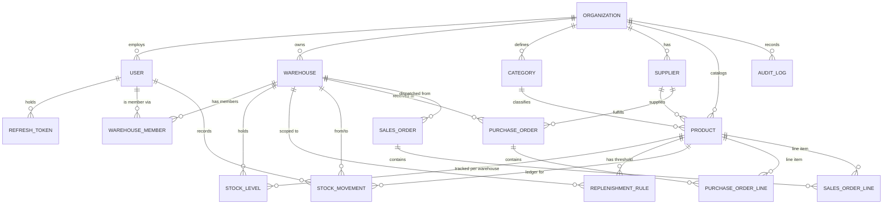

# Praella Warehouse/Inventory Management System — Architecture

Practical test target: Senior Backend Developer (Tier 3, 5+ yrs), Praella.
Source spec: `Praella - Senior Backend Developer Practical Test - Tier 3(5+ Yr exp).pdf`

Stack (as specified): Node.js + Express + TypeScript, PostgreSQL + Prisma, JWT,
Zod, Redis, BullMQ, Jest + Supertest, Swagger, React + TypeScript + Tailwind.

## 1. System overview

```
                         ┌────────────────────┐
                         │   React + TS SPA    │  (Tailwind, desktop-first)
                         │  client/            │
                         └──────────┬──────────┘
                                    │ REST (JSON) + JWT bearer
                                    ▼
                         ┌────────────────────┐
                         │  Express API (TS)   │
                         │  server/src         │
                         │  routes→validate→   │
                         │  authz→controller→  │
                         │  service→repository │
                         └──┬───────┬───────┬──┘
                 ┌──────────┘       │       └───────────┐
                 ▼                  ▼                   ▼
        ┌─────────────┐   ┌────────────────┐   ┌────────────────┐
        │ PostgreSQL   │   │ Redis          │   │ BullMQ workers │
        │ (Prisma ORM) │   │ (cache +       │   │ (bulk stock,   │
        │              │   │  BullMQ store) │   │  low-stock scan│
        └─────────────┘   └────────────────┘   │  order events) │
                                                 └────────────────┘
```

Single repo, two packages: `server/` (API) and `client/` (SPA). `server/` is
the graded deliverable; `client/` is a thin admin UI over the API (the PDF
treats frontend polish as a bonus, backend correctness as the core ask).

## 2. Domain model

Multi-tenant root is `Organization`. Every other row is reachable from one,
directly or via warehouse membership. This is what makes "each user only
sees their own warehouses" and "org-level collaboration" both true at once:
ownership is `Organization`-scoped, collaboration is `WarehouseMember`-scoped.

Revised in the walkthrough pass (superset of the original list): added
`RefreshToken` (token rotation/revocation), `Category` as its own entity
(rather than a free-text field on `Product`), `AuditLog`, and
`IdempotencyKey`. `StockMovement` gained an `ADJUSTMENT` type for correcting
mistakes without deleting ledger rows. These are flagged as optional/
trimmable in section 10 if time runs short.

```
Organization
  id, name, createdAt

User
  id, organizationId → Organization, email (unique), passwordHash,
  role: Enum(ADMIN, MANAGER, STAFF), createdAt
  -- role is the org-wide default; per-warehouse override lives on WarehouseMember

RefreshToken
  id, userId → User, tokenHash, revokedAt: DateTime?, expiresAt, createdAt
  -- rotated on every /auth/refresh call; revoked row = replay rejected

Warehouse
  id, organizationId → Organization, name, address, createdBy → User, createdAt

WarehouseMember                          -- collaboration + access-scoping join
  id, warehouseId → Warehouse, userId → User,
  role: Enum(ADMIN, MANAGER, STAFF) nullable   -- override; falls back to User.role
  unique(warehouseId, userId)

Category
  id, organizationId → Organization, name

Supplier
  id, organizationId → Organization, name, contactEmail, phone

Product
  id, organizationId → Organization, sku (unique per org), name,
  categoryId → Category, unitPrice: Decimal, supplierId → Supplier, createdAt
  -- Product is an org-level catalog entry; StockLevel ties it to a warehouse
  -- (the PDF lists "stock quantity" as a product field, but that can't be a
  -- single number once a product lives in multiple warehouses - see StockLevel)

StockLevel
  id, productId → Product, warehouseId → Warehouse, quantity: Int,
  unique(productId, warehouseId)

ReplenishmentRule
  id, productId → Product, warehouseId → Warehouse, minThreshold: Int
  unique(productId, warehouseId)

StockMovement                             -- append-only ledger, never mutated
  id, productId → Product,
  type: Enum(INBOUND, OUTBOUND, TRANSFER_OUT, TRANSFER_IN, ADJUSTMENT),
  quantity: Int,
  fromWarehouseId → Warehouse? (set for OUTBOUND/TRANSFER_OUT),
  toWarehouseId → Warehouse? (set for INBOUND/TRANSFER_IN),
  actorUserId → User,
  referenceType: Enum(PURCHASE_ORDER, SALES_ORDER, TRANSFER, MANUAL)?,
  referenceId: String?                     -- links back to the PO/SO/transfer
  createdAt

PurchaseOrder / PurchaseOrderLine           -- inbound
  PurchaseOrder: id, organizationId, warehouseId, supplierId, status: Enum
    (DRAFT, CONFIRMED, RECEIVED, CANCELLED), createdBy, createdAt
  PurchaseOrderLine: id, purchaseOrderId, productId, quantity, unitCost

SalesOrder / SalesOrderLine                 -- outbound / dispatch
  SalesOrder: id, organizationId, warehouseId, status: Enum
    (DRAFT, CONFIRMED, DISPATCHED, CANCELLED), createdBy, createdAt
  SalesOrderLine: id, salesOrderId, productId, quantity, unitPrice

AuditLog
  id, organizationId → Organization, userId → User, action: String,
  entity: String, entityId: String, oldValue: Json?, newValue: Json?, createdAt

IdempotencyKey
  id, key: String (unique, client-supplied), organizationId → Organization,
  requestHash, responseStatus, responseBody: Json, createdAt
  -- one row per (org, key); a repeat request short-circuits to the stored response
```

`StockLevel.quantity` is a derived/cached total that every `StockMovement`
insert updates transactionally (Prisma `$transaction`) — the movement ledger
is the source of truth; `StockLevel` exists so reads don't have to fold the
whole ledger every time.

### Entity-relationship diagram



## 3. RBAC

Two layers, both enforced server-side on every request:

1. **Role → capability matrix** (coarse-grained, checked first):

   | Action                          | Admin | Manager | Staff |
   |----------------------------------|:-----:|:-------:|:-----:|
   | Create/delete warehouse          | ✅    | ❌      | ❌    |
   | Update warehouse                 | ✅    | ✅      | ❌    |
   | Invite/remove warehouse member   | ✅    | ✅      | ❌    |
   | Create/update/delete product     | ✅    | ✅      | ❌    |
   | View products / stock            | ✅    | ✅      | ✅    |
   | Adjust stock / record movement   | ✅    | ✅      | ✅ (record only, not delete) |
   | Delete a stock movement          | ✅    | ❌      | ❌    |
   | Define replenishment rules       | ✅    | ✅      | ❌    |
   | Create/confirm purchase order    | ✅    | ✅      | ❌    |
   | Create sales/dispatch order      | ✅    | ✅      | ✅    |
   | View org users / manage roles    | ✅    | ❌      | ❌    |

2. **Ownership/scope check** (fine-grained, checked second): the
   authenticated user must belong to the `Organization` that owns the
   resource, and for warehouse-scoped resources, must have a
   `WarehouseMember` row for that warehouse (role resolved as
   `WarehouseMember.role ?? User.role`).

Implementation: `requireRole(...roles)` middleware for (1), and a
`requireWarehouseAccess()` middleware for (2) that loads the membership once
and attaches it to `req.warehouseMembership` for the controller to reuse.

## 4. API surface (REST)

```
POST   /api/auth/signup              create org + first Admin user
POST   /api/auth/login               → { accessToken, refreshToken }
POST   /api/auth/refresh             rotates the refresh token
POST   /api/auth/logout              revokes the refresh token
GET    /api/auth/me

GET    /api/warehouses               list (org-scoped, paginated)
POST   /api/warehouses                Admin
GET    /api/warehouses/:id
PATCH  /api/warehouses/:id           Admin, Manager
DELETE /api/warehouses/:id           Admin
POST   /api/warehouses/:id/members   Admin, Manager
DELETE /api/warehouses/:id/members/:userId

GET    /api/products                 filter: warehouseId, category, search, low-stock
POST   /api/products                 Admin, Manager
GET    /api/products/:id
PATCH  /api/products/:id             Admin, Manager
DELETE /api/products/:id             Admin, Manager

GET    /api/stock/levels             filter: warehouseId, productId
POST   /api/stock/movements          body: {type, productId, qty, from?, to?}  -- manual adjustments
GET    /api/stock/movements          filter: productId, warehouseId, type, date range, paginated

POST   /api/transfers                body: {productId, fromWarehouseId, toWarehouseId, qty}
GET    /api/transfers                paginated, one txn: TRANSFER_OUT + TRANSFER_IN

PUT    /api/replenishment-rules      upsert {productId, warehouseId, minThreshold}
GET    /api/replenishment-rules/alerts   products currently below threshold

POST   /api/purchase-orders
GET    /api/purchase-orders / :id
POST   /api/purchase-orders/:id/receive     → emits INBOUND movement(s), status→RECEIVED
POST   /api/purchase-orders/:id/cancel

POST   /api/sales-orders
GET    /api/sales-orders / :id
POST   /api/sales-orders/:id/dispatch       → emits OUTBOUND movement(s), status→DISPATCHED
POST   /api/sales-orders/:id/cancel

GET    /api/docs                     Swagger UI
GET    /health                       liveness (process is up)
GET    /health/ready                 readiness (DB reachable)
```

State-changing order/transfer endpoints (`/receive`, `/dispatch`, `/transfers`)
accept an `Idempotency-Key` header; a repeat with the same key returns the
original response instead of re-applying the stock change.

All list endpoints: `?page=&pageSize=&sort=&search=` — Zod-validated query
schemas shared between route and OpenAPI generation (`zod-to-openapi`).

## 5. Background jobs (BullMQ, Redis-backed)

- `stock.bulkUpdate` — queued when a request would touch more than N rows
  (e.g. CSV-style bulk stock import), so the HTTP request returns
  immediately with a job id.
- `replenishment.scan` — repeatable job (e.g. every 15 min) that recomputes
  which products are below `ReplenishmentRule.minThreshold` and writes a
  materialized alert list (avoids scanning on every read).
- `order.received` / `order.dispatched` — decouples "write the movement
  ledger + adjust StockLevel" from the order-status HTTP handler so order
  confirmation stays fast even for large multi-line orders.

## 6. Caching (Redis)

- `GET /api/products` and `GET /api/stock/levels` cached per
  `(orgId, warehouseId, query-hash)`, short TTL (30–60s), explicitly
  invalidated on any write that touches that warehouse's products/stock.
- Cache-aside pattern via a small wrapper (`lib/cache.ts`), not a generic
  ORM-level cache — keeps invalidation explicit and auditable.

## 7. Auth & validation

- JWT access token (short-lived, ~15 min) + refresh token (httpOnly cookie
  or rotating refresh token row in DB, ~7 days). Passwords hashed with
  bcrypt/argon2.
- Every route handler's `body`/`query`/`params` validated by a Zod schema
  before it reaches the controller (`validate(schema)` middleware) — this
  is also the single source of truth the Swagger spec is generated from.

## 8. Testing

- Jest + Supertest, one integration-test DB (docker-compose Postgres,
  reset/migrated per test run via `prisma migrate reset --force` in CI or
  a transactional-rollback test helper).
- Coverage priority: auth, RBAC middleware (positive + negative cases per
  role), stock movement transaction correctness (concurrent adjustments
  can't drive quantity negative), order → movement → stock-level pipeline.

## 9. Folder structure

```
praella-warehouse-inventory/
  server/
    src/
      config/            env loading, constants
      middleware/         auth.ts, rbac.ts, validate.ts, errorHandler.ts
      modules/
        auth/              controller, service, routes, schemas
        organizations/
        warehouses/
        products/
        stock/             movements + levels
        replenishment/
        orders/            purchase-orders + sales-orders
      jobs/                bullmq queues + workers
      lib/                 prisma.ts, redis.ts, cache.ts, logger.ts
      docs/                swagger.ts (openapi generation)
      app.ts               express app (no listen)
      server.ts            entrypoint
    prisma/
      schema.prisma
      migrations/
      seed.ts
    tests/
      integration/
      unit/
    docker-compose.yml     postgres + redis for local dev
    .env.example
    package.json
  client/
    src/
      pages/               Login, Dashboard, Warehouses, Products, Orders
      components/
      api/                 typed fetch client against the OpenAPI schema
      auth/
    package.json
  README.md                deliverable: setup, tech stack, summary, seed data
```

## 10. Resolved decisions / trim list

Resolved:
- **REST**, not GraphQL.
- **Refresh tokens are DB-backed and rotating** (`RefreshToken` table above).
- **Local docker-compose is the deployment target for submission** — README
  gets detailed local setup steps rather than a hosted deployment.
- **GitHub**: local `git init` + commits happen as we go; creating the
  public repo and pushing is a separate step done only when explicitly
  confirmed.

Trim-first list if time runs short (cut here before cutting anything in
section 3, 11 or 14 — RBAC, transactions, and stock/order correctness are
the actual grading core): `Role`/`Permission` tables (the
role-string-on-User + WarehouseMember-override model above already
satisfies the RBAC requirement without them), `AuditLog`, `IdempotencyKey`,
GraphQL, hosted deployment. Anything trimmed gets listed under "Pending
items" in the README per the PDF's deliverable format.

## 11. Phase status

- **Phase 1: done.** `server/` scaffolded — TypeScript, Express app with
  `/health` + `/health/ready`, Prisma wired to Postgres (no models yet),
  `docker-compose.yml` (Postgres 16 + Redis 7), `.env.example`.
- **Phase 2: done.** Full Prisma schema (17 models per the ER diagram
  above), `init` migration applied, `prisma/seed.ts` with sample data
  matching the brief's own iPhone/Surat/Mumbai/Ahmedabad example.
  Note: this dev machine's Docker Desktop failed to start (WSL2 backend
  never provisioned its internal distros) — migrations were run and
  verified against a local native PostgreSQL 18 install instead, with
  `docker-compose.yml` unchanged and still the documented path for anyone
  whose Docker works. See README's "Troubleshooting: Docker Desktop won't
  start" section.
- **Phases 3-17: all done.** Auth, two-layer RBAC, warehouses, catalog
  (category/supplier/product), the shared inventory transaction engine
  (`lib/inventory.ts`), stock movements, transfers, replenishment rules +
  alerts, purchase/sales orders (both driving the same engine), pagination/
  search/filtering (built into every list endpoint from the start), Redis
  caching (fails open), BullMQ background jobs (bulk stock update,
  scheduled replenishment scan), rate limiting, audit logs, request
  logging, 32 Jest/Supertest integration tests (including a live
  concurrency test), Swagger UI at `/api/docs`, and the React/TS/Tailwind
  frontend. See README's "Project summary" for challenges, what's
  pending, and two real bugs a live browser smoke test caught that the
  automated tests hadn't (both fixed).
